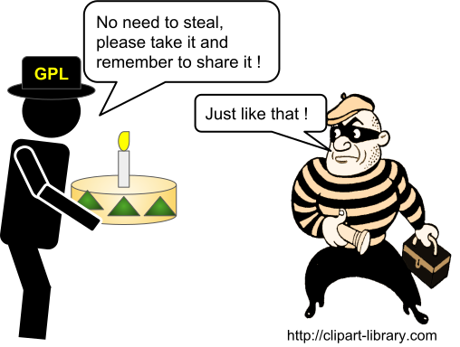

name: inverse
layout: true
class: middle, inverse

---

# Software licensing and citation

### [Jyry Suvilehto](http://jyrsa.iki.fi) ([NeIC], [CSC - IT Center for Science])

### [Radovan Bast](http://bast.fr) ([NeIC],[UiT The Arctic University of Norway])

### [Richard Darst](http://rkd.zgib.net) ([Aalto University])

### [Sabry Razick](http://uio.no) ([Neic], [University of Oslo, Norway])

Text is free to share and remix under [CC-BY-SA-4.0](https://creativecommons.org/licenses/by-sa/4.0/).

Acknowledgements:
- Oxana Smirnova (suggestions and corrections)

---

layout: false

# Goals

## 1) Why software licenses matter
## 2) Guidance on which license to choose
## 3) .blue[Discussion]

---

## Questions we will try to answer

- How can you protect your ideas, names, and implementations?
- Can you copy-paste code from the internet into your code?
- Who owns the code you write?
- Who owns the code you have modified/rewritten?
- How software licenses can influence the impact of your code.
- How to motivate contributions to your code by choice of license?

## Disclaimer

- 0% of authors have law degrees
- This is not legal advice

---

## Who owns a physical object?

- The one who has control
- Ownership documentation   

## Who owns ideas and data?

- Intellectual property rights: protect abstract creations
  - Your work should eventually benefit human kind as a whole
  - Before that you are given certain exclusive rights so as to enjoy the
    fruit of your effort
- Data, ideas, etc. are easy to copy
  - Legally, *not* allowed in many cases
  - Everything is free eventually, but that may take 100+ years
- If you don't give permission, your work dies and rots


---

## Copyright vs. Patent vs. Trademark, an example


- Copyright: You are Goethe and your writings are widely published, you are
  given a right to some of the proceeds from selling copies (.blue[expression of an idea])
- Patent: You invented a better printing press and are given the exclusive
  to manufacture printing presses that use the technique (.blue[invention])
- Trademark: You start selling the printing press with the name AutoPress, which
  distinguishes your press from others (.blue[Ownership]). 

<!-- Printing press was the reason copyright was necessary in the first place.
Before the printing press copying anything was manual labour and the cost of
copies was mainly in the act of copying. After the printing press copying
became so simple that it was no longer a major cost: there was money left over
and the question was should it go all to the printer or some also to the writer.
-->

---

## Copyright vs. Patent vs. Trademark

### When we create software, we may create patentable .blue[ideas], copyrightable .blue[expressions] of ideas, and trademarkable .blue[names]

- **Ideas and facts** are *always free*
- *Copyright* protects the **creative expression** of an idea
- Automatically attached to every *novel* expression (certain amount of years)
- Software that you write is copyrighted by default (comparable to
  literature or poetry)
- No-one besides copyright holder has the right under copyright law to create "derivative works" (unless the license permits it)
- The owner of copyright has the right to dictate *distribution and creation of copies* in order to profit
- If you infringe on someone's copyright you must pay reasonable damages but
  you can keep on doing what you do as long as the copyright holder makes
  profit
- "Fair use rules" are an exception
  - Parody
  - Criticism
  - Quotation

<!--- This talk is mostly about copyright.  Patents are a much more
complex and limited concept.  Most software can't be patentatable, and
after you publish your ideas, patenting is impossible.  So, we
focus on copyright, as you should too.  -->


---

## Copyright vs. Patent vs. Trademark
- *Patents* protect **novel technological inventions**
  - Also business process patents exist
  - Must be applied for, short number (10-20) of years
  - Patents are granted by individual countries
  - Must actually be novel and not yet publicly known
  - Must be actually used
  - If you infringe on someone's patent you may be compelled to stop doing
    what you are doing
- *Trademark* is the right to not be impersonated
- You cannot put a copyright or patent on an algorithm.
  - Or can you (Google search algorithm)?

<!--- Patents are so sacred that even during WWII German aircraft
manufacturers paid patent royalties to american corporations on fighter
jet engine designs. Imagine Sean Bean saying "One does not simply infringe
patents" -->


---

## Copyright in Finland

- Copyright duration is lifetime of author + 70 years
  - In case of multiple authors, count from the last one
- Parody is not an exception of the derivative works rule
- Copyright is typically transferred to employer for works done in the context
  of salaried work
  - Researchers working on grant money are not salaried
  - Researchers and teachers working *independently* in universities are an
    exception
      - Exact meaning of the current provision is not clear
  - You still have the right to be recognized as the author
  - If you wish to license a piece of software you write for work you should
    typically have permission from your employer
      - Easiest to have an Open Source Policy
- Certain exceptions that are not copyrightable
  - Trivial code (or other content)
    - Does not meet **threshold of originality**
  - Code that implements an API

---

## Copyright in Finland Part 2

- Related rights (lähioikeudet)
  - Protect things that might not meet threshold of originality
  - Recordings, photographs, **databases**
  - Less stringent duration, etc.
- Certain exceptions
  - Trivial code
  - Code that implements an API
- *Finnish law does not recognize large parts of fair use doctrine*
  - Parody
  - Commentary
  - Criticism
  - But are allowed to make personal copies
  - This is likely to be overruled if ever taken to EU courts but that is a
    long process...


---

## These slides are an expression of an idea

- Can I patent them?
- Do I need to copyright them?
- Are you allowed to share them via email or Twitter or similar?

---

## These slides are an expression of an idea

- Can I patent them? .blue[No]
- Do I need to copyright them? .blue[No (copyright by default), but you could have one]
- Are you allowed to share them via email or Twitter or similar? .blue[Yes!]

### Yes to sharing!

- Sharing explicitly allowed by creative commons license (CC BY-SA 4.0) on the first page
- Otherwise probably fine according to "fair use"

---

## Relation to scientists

- You come up with **ideas**
- Ideas are published in **papers**
  - Papers might have limited access, but *anyone* can use the ideas in them
  - Your goal is to get citations for your paper by people using or improving your ideas
- Your **software** may implement an idea in your paper
  - For your ideas to be used, software should be usable
  - If people can use or improve your software, they can more easily use your ideas
  - If people *can't* reuse and extend your software, your research may become a dead end

<!---
Maybe scientists aren't the only audience, but may be useful to start here anyway.

- Emphasize that trying to protect your code usually doesn't do you
  that much good: your ideas are purposely put out there when you
  publish.
- If your code isn't free software, people might take your code and
  run it, but not reuse it.  Following up on your work becomes much
  harder, since they have to re-create everything.

Copyright protects a certain expression.  If you publish a paper on
your idea, someone can always read that paper and re-create your
method.  Don't think that copyright gives you magic protection.

-->
---

## Related rights and scientists

- If you make measurements, the collection may be a protected catalogue or database
- It's best to explicitly give permission to use published tables, catalogues
  or databases when publishing them

---

## Software license

- Not having a license is worse than having one 
	- No license, no one want to use it
	- Some sort of license will encourage usage under the specified conditions
	- Public domain	or unlicensed, not the same as no license
- Free and open software
	- Copyleft 
	- My Ubuntu copy
- Proprietary software
	- My Windows copy and license-key
- More on license categories
- How to use or adopt licensed material 
---

## What happens if I do not choose a license?

- Software that you write is copyrighted by default
- Without a license it is not clear what use breaks copyright
- Nobody who is careful about her/his code base should use or even look at your code
- In other words: code without license is not useful for reuse or derivative work
- Your ideas won't get used

---

## Why free software?


---


## Free as in beer or free as in speech?


---


## Copyright Vs Copyleft


- Copyright  
	- protect authors from unauthorized copying or selling of their work. 
	- only with the author's permission may such activities take place.
- Copyleft
	- Provides a method for software or documentation to be modified distributed back to the community, provided it remains free (Libre). 

(Source :https://www.gnu.org)
---


## What is free software?

### Software freedom

Is the freedom to ...

- ... run the software for any purpose
- ... study how the software works and to adapt it to your needs
- ... redistribute copies of the software
- ... improve the software and distribute your improvements to the public

---

## What is free software?

### .blue[Free software does not mean that software is free of charge]
### .blue[Open source license does not mean you need to share everything immediately]
### .blue[Open source does not mean public domain]: software in the public domain has no owner
### .blue[Open source does not mean non-commercial]: plenty of companies produce and support it

<!---

Example: Ubuntu is free software.  It is supported by a company called
Canonical.  Many people make free software.  Canonical packages it up as
Ubuntu.  Because the software guarantees freedom, Canonical can't make Ubuntu
closed-source.  Canonical doesn't make money out of the software itself - only
their actual value-added services which they offer to companies.

Example: you come up with a formula and a piece of software to improve a
chemical process.

Relate this to the value of what people have and want - much software is so
small it isn't/can't be sold, but through a proper license others can help it
make an impact.

-->

---
## Broad categories of licenses

We have three broad categories:

- Permissive license
  - Let people do anything they want with the code as long as they provide attribution back to the author/s and don’t hold the author/s liable.
- Viral/share alike licenses
  - Copyleft
  - Must stay open in future
  - Commercial and other use OK, as long as stays open
  - Owners can always go closed later.
- Proprietary/closed
  - No one may copy, modify, improve, and so on
  - The *default*

Use a common one: https://choosealicense.com, Wikipedia

---


## Software licensing and open source explained with cakes


- Imagine you compose a recipe for a really tasty cake (a great idea).
- In regular intervals you distribute cakes (release binaries).
- Your family and friends love it.
- But you can only bake so many.

(cake emoji licensed under CC-BY-SA-4.0, attribution: Emoji One)

<!--- Perhaps may be worth saying that this is a metaphor - the
ingredients list and basic instructions simply facts, so not
protectable.  However, your description *is* protectable. -->

---

## Possible outcomes 0/4: closed

### Closed source (recipe never released)

- Your cake is celebrated by The New Yorker magazine.
- People will have difficulties to reproduce your celebrated recipe.
- Nobody else will improve your recipe.
- Bad copycats might appear, you don't get any credit.
- Fewer tasty cakes will get consumed.

---

## Possible outcomes 1/4: custom or no license

### No license or custom license

- No restaurant chef will touch it: too much hassle to employ a lawyer to be sure
  that the cake can be served to customers.
- But maybe they will bake it and eat it and not distribute it and that is OK.
  - So called "fair use" provision permits the making of copies for own use

<!--- The restaurant industry is infamous for copying recipes and there are
very few published court cases. Let's skim over this fact and stay in the
fictitious example though. -->

---

## Possible outcomes 2/4: permissive

### License: MIT or Apache or BSD-2

- It is OK to use the recipe and sell the cake.
- It is OK to not share the improved recipe.
- If somebody becomes sick, it is not the fault of the OpenCake organization (limit of liability).
- You may not get the improvements back to use yourself.

### License: BSD-3

- In addition to the above it is understood that the updated recipe are not endorsed by the OpenCake organization.

---

## Possible outcomes 3/4: share-alike

### License: GNU Lesser GPL (LGPL)

- The famous restaurant has to share only the improved cake recipe but can keep the rest of the menu closed.
- The restaurant guests have to be able to exchange the cake from the menu by improved cakes from other restaurants (dynamic relinking).

### License: Mozilla Public License v2.0

- Like LGPL but do not require that the modified cake can be exchanged by the restaurant guest.

---

## Possible outcomes 4/4: viral

### License: GNU GPL or GNU Affero GPL (for web services)

- If the cake is a part of the menu, the famous restaurant has to share the recipes of the **entire menu**.
- You can use their improved recipe and improve it further:


- Other restaurants can then reuse and improve the full menu and the hope is that we will all eat better food.
- You support open restaurants.  You can use everything they do, too.

<!--- Example of benefits of virality in software: Linksys routers and
GPL's kernel image. Some company used linux, didn't distribute source.
They were fourced to distribute it, and that has directly led to
a huge community of firmware modders.  -->

---


## What outcomes did we have?

- Others **re-implemented** our idea: little credit
- Others could use in **closed-source**
  - BSD Unix (permissive, included in Windows)
- Others could use, **had to re-share**
  - Linux (viral, derivatives are still open)

In real world, **dual licensing** is common: GPL for anyone, but you can pay for commercial non-GPL

---
## Broad categories of licenses

We have three broad categories:

- Permissive license
  - Anyone can made closed source
- Viral/share alike licenses
  - Must stay open in future
  - Commercial and other use OK, as long as stays open
  - Owners can always go closed later.
- Proprietary/closed
  - No one may copy, modify, improve, and so on
  - The *default*

Use a common one: https://choosealicense.com

---

## What happens if I do not choose a license?

- Software that you write is copyrighted by default
- Without a license it is not clear what use breaks copyright
- Nobody who is careful about her/his code base should use or even look at your code
- In other words: code without license is not useful for reuse or derivative work
- Your ideas won't get used

---

## Questions to ask yourself when looking for the right license

- What do you want to achieve?
- What do you wish to avoid?
- Do you want to make money with the project?
- Do you mind if others do?
- Do you care about having access to derivative work?
- Do you want to attract developers?
- Do you care about impact of your code? Proprietary software users?


---
## Back to software.  What outcomes can **you** have?

---
## Back to software.  What outcomes can **you** have?

### Closed or unlicensed
- If you want to make money selling "cakes", you keep it closed.
- Closed appropriate if it contains trade secrets or patentable material (**rare**)
- Closed will give limited long-term impact.

---
## Back to software.  What outcomes can **you** have?

### Closed or unlicensed
- If you want to make money selling "cakes", you keep it closed.
- Closed appropriate if it contains trade secrets or patentable material (**rare**)
- Closed will give limited long-term impact.

### Open and licensed
- Broader impact in most cases.
- The best ideas incorporated into larger open source software
- Community of improvements
- Science is reproducible
- GPL still gives original creators more rights than other users, and
  is recommended if you might want to commercialize later.

---
## Zoo of licenses

- (most permissive)
- Public domain (CC0)
- Permissive (MIT, BSD) (CC-BY)
- Patent protection (Apache)
- Share-alike (LGPL) (CC-BY-SA)
- Viral (GPL2/3)
- Viral including webservices (AGPL)
- (most freedom-preserving)

There are *many* licenses, but you should not be creative.  **Use the
most common** for your situation, license proliferation is a real problem.
- a bad example of a license [JSON license](https://www.json.org/license.html)

http://choosealicense.com

<!--- Don't spend much time on this, just make the point there are -->
<!--many options.  Go to next slide -->

---

## Who owns the copyright for software you write?

- You?
- Your university?

### Intellectual property depends on the country!

- So-called works made for hire
- Personal experience: if you ask legal experts it can get complicated
- Nobody can take away code from you if you develop in your free time on your hardware using your own network
  - ...maybe. Your employer can still threaten to take you to court and use a
    **chilling effect**

### Even within a country it can vary depending on the employer (public vs private)

---

## If you own your software

- You can relicense
- You can dual-license

### If you do not own your software, you can:

- Request a transfer of ownership (check with your university)
- Open source your code to make sure you are not locked out of your own code
  once you change affiliation (you might need to ask your university)

<!--- Fun story: I once had a friend who worked at IBM.  In their
division, they always tried to open-source what they worked on,
because if they didn't some other division could come and take it away
from them to put in some product.  By open sourcing, they ensure even
their internal rights to do their work! -->

---

## Practical aspects

### Running a project

- License your code very early in the project
- Consider license-compatibility "up" and "down"
- Agree on a licensing strategy and make it public and visible

### Licensing

- Add a LICENSE file to your repository (GitHub understands it)
  - Use GitHub web to add file named LICENSE and it helps you select!
  - You should check that GitHub can automatically detect the license
- License your supporting information (images) under
  creative commons (use [Zenodo](https://zenodo.org) or [Figshare](https://figshare.com))

### Citations and credit
- Open source license can't demand citation, but it is required by science ethics anyway.
- Make it as easy as possible!  Clearly say what you want cited.
- [Citation file format](https://github.com/citation-file-format/citation-file-format)

---

## Should I add a copyright header?

You should mark an original work with a copyright notice in the form:

```
(c) Copyright <year> <author>
```

- Does NOT give you copyright - copyright is automatic even if there is no notification
- However it provides added protection: defendant cannot argue s/he was unaware who owned the copyright on the work

Reference: http://www.rosenlaw.com/oslbook.htm

---

## What if someone contributes to my project?  Or vice versa?

- General convention: contributing to a project with an existing license
  - Accepts that license for contribution
  - Does NOT transfer ownership (project has multiple owners, which is OK)
- You only need to prove if needed: for large projects, maybe you request something more explicit.


### Or I use someone else's code?
- You can, if the [licenses are compatible](https://en.wikipedia.org/wiki/License_compatibility)
- You do *not* then own it (multiple owners, which is OK)
- Should *document* licenses, including ownership of different parts (comment is minimum)
- Custom licenses are *hard* and bad.

Image from [David A. Wheeler's license slide](https://www.dwheeler.com/essays/floss-license-slide.html), CC-BY-SA 3.0.  This is compatible with CC-BY-SA 4.0 (this presentation), so we can use it.

---

## Recommendations

- You *can't* ignore licensing: default is "no one can make copies or
  derivative works"
- The *earlier* you license, the easier it is.
- Take an [OSI](https://opensource.org/licenses)-approved license: makes it easier to evaluate
  [compatibility](https://en.wikipedia.org/wiki/License_compatibility)
- Do not use custom licenses for open source: compatibility not clear
- Make it easy to cite your code

---

## Radovan's personal choices

### When I have the choice, I prefer to ...

- ... use an open source code (scientific reproducibility)
- ... develop under an open source license to keep access to my code
- ... develop under a share-alike license in order to not lock myself out of improvements to my code
- ... contribute to a share-alike licensed software of others because I know they won't run away with my code
- ... distribute my code under a share-alike license to motivate people like me to contribute

### When I am "forced" to contribute to a closed-source code ...

- ... I contribute my code explicitly under LGPL or MPL (to not lose control)

### Food for thought

Is closed-source development compatible with reproducible research?

---

## Jyry's personal choices

### When I have the choice, I prefer to ...

- ... use code that is likely to be maintained in the future (active open source project or
      paid for closed source license)
- ... develop under an open source license to make myself feel I'm
  contributing to humanity
- ... develop under a permissive license to foster both commercial and and community activity around the codebases I work with
- ... develop under MIT License to avoid having to deal with contributor
  license agreements
- ... contribute to projects under whatever open license they might have to support the community around the code

### In practice

- ... I do whatever my employer tells me to

### Food for thought

Is closed-source development compatible with reproducible research?

---


## Good resources for software licensing

- https://www.software.ac.uk/choosing-open-source-licence
- https://choosealicense.com
- http://oss-watch.ac.uk/resources/ipr
- http://www.rosenlaw.com/oslbook.htm
- http://depth-first.com/articles/2006/12/29/dispelling-open-source-confusion-an-introduction-to-licenses/
- http://blog.milkingthegnu.org/2008/03/10-answers-for.html
- http://www.oreilly.com/openbook/osfreesoft/
- https://tldrlegal.com/
- https://hintjens.gitbooks.io/social-architecture/content/chapter2.html
- https://users.aalto.fi/~darstr1/cheatsheets/ipr-cheatsheet.pdf

---


## End main talk

After this point we have assorted topics, which can be gone through
faster or slower depending on audience desires.

## Questions?


---

# Assorted topics


---

## Making your code citable

### Create a DOI for each release

- https://guides.github.com/activities/citable-code/
- https://zenodo.org

---

## Citation file format

- [A standard format for CITATION files](https://software.ac.uk/blog/2017-12-12-standard-format-citation-files)
- [Citation File Format (CFF) 1.0.3](https://citation-file-format.github.io)


### Specifications

- Machine-readable
- Human-writable: easy to read, write and edit
- Standard format: [YAML](http://yaml.org)
- Support fine-grained types: software source code, software executable, software container, and virtual machine (image), etc.
- Versioned
- Include DOI, hash, or at least contact information
- Support all scenarios for authorship and roles for authors
- Allow to link to [ORCID](https://orcid.org)
- Compatibility with other formats (Zenodo, Figshare)
- Allow unicode, UTF-8 encoding

---

Example [CITATION.cff](https://github.com/citation-file-format/citation-file-format/blob/master/CITATION.cff) file:

```
cff-version: 0.9-RC1
message: "If you use, or want to cite, the Citation File Format in this version (0.9-RC1), please use the following metadata."
references:
  - type: report
    authors:
      - family-names: Druskat
        given-names: Stephan
        orcid: 0000-0003-4925-7248
        role: main-author
    title: "Citation File Format (CFF)"
    version: 0.9-RC1
    repository-code: https://github.com/sdruskat/citation-file-format
    year: 2017
    date-published: 2017-10-06
    doi: 10.5281/zenodo.1003150
```

---

## Can I copy-paste code from Stack Overflow into my code?

---

## Can I copy-paste code from Stack Overflow into my code?

- Non-code: CC BY-SA 3.0 with attribution required
- Code: MIT license

### You are recommended to do one of these 2 things, or both:

- A) Add a comment to your code that links back to the post where you found it, or
- B) Comply with the MIT as it is typically used, by including the full license text in your source

https://meta.stackexchange.com/questions/271080/the-mit-license-clarity-on-using-code-on-stack-overflow-and-stack-exchange

---

## Back to code: derivative works

- Collective works and derivative works are also original works of authorship
- Collective work: aggregation of separately written software
- Joint work: contribution to a joint work is owned by all of its authors jointly

### Why is it important to know?

- Because the license may limit what you can do with the derivative work

Reference: http://www.rosenlaw.com/lj19.htm

---

## How can you tell when you have created a derivative work?

- Modifying source code by revising the code or translating it into another
  computer language, recasting, or adapting is derivative work

### Typically not derivative works:

- Linking to libraries (static or dynamic), plug-ins, and drivers
- If you can use a code without looking at the source code (library), you are probably not creating derivative work

Reference: http://www.rosenlaw.com/lj19.htm

---

## Clean room design

You need at least two persons/teams

1. Team A studies code A
2. Team A writes specifications for code A
3. Legal team checks specifications
4. Team B never sees code A
5. Team B implements code B based on specifications

Result is **not** derivative work.

---

## Are you allowed to use open source software in a closed source project?

Depends on whether you distribute it:

- No distribution: you can use it in almost any way you can imagine
- If distributed: depends on the open source license

### How can somebody find out that you redistribute open source software breaking license terms if you distribute only binaries?

---

## Are you allowed to use open source software in a closed source project?

Depends on whether you distribute it:

- No distribution: you can use it in almost any way you can imagine
- If distributed: depends on the open source license

### How can somebody find out that you redistribute open source software breaking license terms if you distribute only binaries?

- Unethical (and illegal)
- Problematic for your own court case if somebody else stole your closed source code

---

## Can I change the license later?

- The copyright owner can
- Who is the copyright owner if your code got contributions from other
  developers? You may need to get a signed agreement from all past
  contributors.
- Consider drafting a contributor license agreement (CLA) and copyright assignment (CA)
- Make contributors aware that contributions may imply CLA and CA

---
<!--- move to end with details? -->
## Problems with public domain

- In certain jurisdictions you cannot just give up your rights without an explicit license
- Public domain does not provide you a warranty and does not protect you from a lawsuit

Source: http://blog.milkingthegnu.org/2008/03/10-answers-for.html

Public license releases the original author from all responsibilities, and does
not guarantee that software does what it was intended to do; the other end of
the spectrum is a guaranteed service and responsibility for bugfixing.


---
<!---
TODO


- What if I want someone to cite me?  (don't make it a license criteria, you become incompatible.  This is always required by scientific ethics anyway!)
- We are moving towards a future where all abstract things are owned.  Is this good?
- GPL-type licenses generally match what people expect for "unlicensed/noncommercial" anyway!
-->
